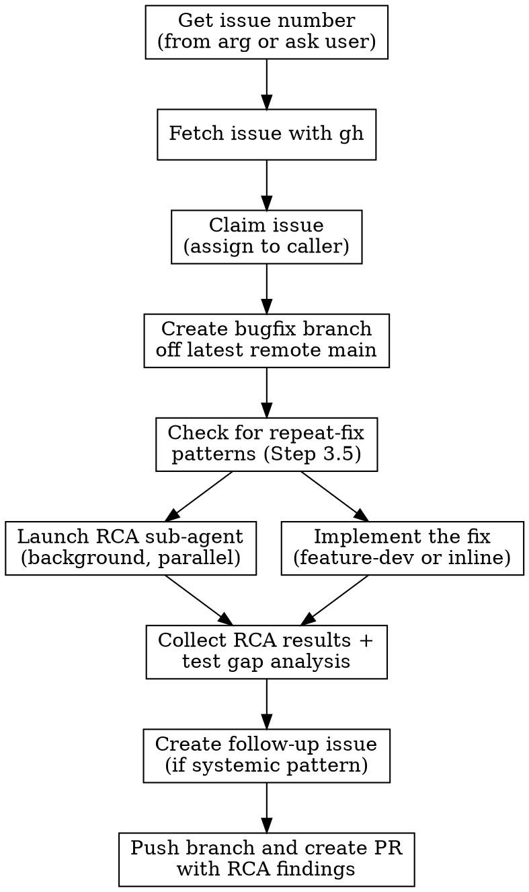

# Fix GitHub Issue

Orchestrates the full lifecycle of fixing a GitHub issue: fetch issue details, branch, investigate root cause in parallel with implementing the fix, enforce regression tests, and open a PR with RCA findings.

## Workflow



## Step 1: Get the Issue

If an issue number was provided as an argument, use it. Otherwise ask:

> What GitHub issue number should I fix?

## Step 2: Fetch Issue Details

Run `gh issue view <number>` to get the full issue title, body, labels, and comments. This becomes the spec for the fix.

If the command fails, confirm the user is in the correct repo and authenticated with `gh`.

## Step 2.5: Claim the Issue

Check the issue's current assignee from the `gh issue view` output.

**If the issue is unassigned:**

```bash
gh issue edit <number> --add-assignee @me
```

Silently assign and continue. If the assignment command fails, warn the user but continue — assignment is non-blocking.

**If the issue is already assigned to you:**

Silently continue to Step 3.

**If the issue is already assigned to someone else:**

Ask the user:

> This issue is currently assigned to `<assignee>`. Do you want to reassign it to yourself, or continue without reassigning?

- If **reassign**: `gh issue edit <number> --remove-assignee <current> --add-assignee @me` — then continue.
- If **continue without reassigning**: Proceed to Step 3 with no assignment change.
- If **abort**: Stop the workflow entirely.

## Step 3: Create Bugfix Branch

```bash
git fetch origin
git checkout -b fix/<issue-number>-<short-slug> origin/main
```

Derive `<short-slug>` from the issue title: lowercase, hyphens, max 4-5 words. Example: `fix/42-null-pointer-on-login`.

If there are uncommitted changes in the working tree, **stop and ask the user** how to handle them (stash, commit, or discard) before switching branches.

## Step 3.5: Check for Repeat-Fix Patterns (Adversarial Dependency Analysis)

**BEFORE implementing a fix**, check if this issue is part of a whack-a-mole pattern — a class of bugs that keeps recurring because each prior fix only addressed a symptom.

```bash
# Search for related closed issues in the same area
gh issue list --state all --search "<keywords from issue>" --limit 20
```

**Indicators of a repeat-fix chain:**

- 2+ prior closed issues with similar symptoms in the same module/subsystem
- Prior fix commits that patched the same function or touched the same error-handling branch
- A sequence of fixes each catching "one more" edge case (new exception type, new response shape, new event name)

**If the issue matches a repeat-fix pattern:**

1. Note this in the implementation Discovery phase
2. Propose a **systemic fix** (error taxonomy, state machine, allow/deny-list, exhaustive pattern match) rather than another point fix
3. Frame the PR as addressing the class of bugs, not just the specific instance
4. Record the chain (list of prior issue numbers and fix commits) in the follow-up issue from Step 4.6

**If no prior pattern exists**, proceed normally — it may be a genuine one-off bug.

## Step 3.7: Launch RCA Sub-Agent (Background)

**Immediately after Step 3.5**, launch the RCA investigation sub-agent in the background. It runs **in parallel with the implementation** (Step 4), so the fix and the root cause investigation happen concurrently.

**Load the agent prompt** from `.agents/skills/fix/prompts/rca-agent.md`. Replace these placeholders:

| Placeholder | Value |
|-------------|-------|
| `{issue_number}` | The GitHub issue number |
| `{issue_title}` | The issue title from Step 2 |
| `{branch_name}` | Current branch (`git branch --show-current`) |
| `{issue_body}` | The full issue body from Step 2 |
| `{repeat_fix_context}` | Findings from Step 3.5, or "No prior pattern found" |

**Dispatch with `run_in_background: true`:**

```
Agent tool:
  subagent_type: "general-purpose"
  run_in_background: true
  description: "RCA for issue #<number>"
  prompt: [interpolated rca-agent.md content]
```

The agent will investigate git history, search for related issues, assess test gaps, and identify process improvements — all while the fix is being implemented.

**Do not wait for this agent to complete.** Proceed immediately to Step 4. You will be notified when the background agent finishes. Its results are collected in Step 4.5.

## Step 4: Implement the Fix

Prefer invoking a `feature-dev`-style orchestration skill if available, so the fix goes through the full Discovery → Exploration → Questions → Architecture → Implementation → Review flow.

### 4a: Check for a feature-dev skill

Look for any available invocable workflow skill that orchestrates feature development (names commonly include `feature-dev`, `feature-engineer`, or similar). In Claude Code this is often surfaced as `feature-dev:feature-dev`.

### 4b: If a feature-dev skill IS available

Invoke it. Pass the issue details as the feature request context.

**CRITICAL**: The feature-dev workflow is interactive. It asks clarifying questions, proposes architecture, and waits for user approval at each phase. Do NOT skip these interactions. The "feature" being developed is the bugfix.

Frame its Discovery phase around the issue:

- **What problem**: The bug described in the issue
- **What should the fix do**: Resolve the reported behavior
- **Constraints**: Minimize scope to what the issue requires
- **Repeat-fix check**: [Include findings from Step 3.5 — is this part of a pattern?]

Let it run through all its phases.

### 4c: If a feature-dev skill is NOT available

Fall back to an inline fix loop:

1. **Explore** the implicated code with Grep/Read to confirm the bug location
2. **Form a hypothesis** about the root cause (will be verified against the RCA agent's findings in Step 4.5)
3. **Implement the minimal fix** — one change that resolves the reported behavior; resist expanding scope
4. **Write a regression test** that would have failed on the pre-fix code (see Step 4.5b — this is a hard gate)
5. **Run project quality gates** (lint, type check, tests) and iterate until green

Record the fix summary and test additions — they will be needed for the PR body in Step 5.

## Step 4.5: Collect RCA Results and Test Gap Analysis

After the implementation completes, collect the RCA sub-agent's results (launched in Step 3.7) and run the test gap analysis on the actual diff.

### 4.5a: Collect RCA Sub-Agent Output

The background RCA agent (Step 3.7) should be complete or nearly complete by now. If the agent has finished, its results are already available. If it hasn't finished yet, you will be notified when it completes — wait for it before proceeding.

Once the RCA agent's output is available, extract these sections from its response:

- `RCA_CAUSE` — root cause sentence with receipt
- `RCA_INTRODUCING_COMMIT` — SHA, date, author, PR link
- `RCA_CONTEXT` — was this a refactor, new feature, previous fix?
- `RCA_RELATED_ISSUES` — related issues/PRs found
- `RCA_TEST_GAP` — what test was missing (from the agent's pre-fix analysis)
- `RCA_PROCESS_IMPROVEMENTS` — actionable improvements
- `RCA_CONFIDENCE` — integer 0-100

**If `RCA_CONFIDENCE` is below 60**, the PR body will note "Root cause unconfirmed." Do not fabricate a cause. (The evidence protocol defines 0-59 as insufficient for asserting root cause.)

### 4.5b: Test Gap Gate (Hard Gate)

Verify that the fix includes regression tests. This is a **hard gate** — do not proceed to Step 5 if no test files are in the diff.

```bash
git diff --name-only origin/main | grep -Ei "(^|/)(test_|_test\.|tests?/)"
```

Adjust the pattern for the project's test naming convention as needed.

**If no test files appear in the diff:**

Stop. Return to the implementation and add a regression test that:

- Exercises the exact code path that was broken
- Would fail on the pre-fix code (verify mentally or by describing the failure mode)
- Passes on the post-fix code
- Follows the test-engineer skill standards (meaningful assertions, `spec=` on mocks, proper error path testing)

Re-run quality checks after adding the test, then return here.

**If test files are present**, assess the test quality by reading the test additions in the diff:

| Question | Answer |
|----------|--------|
| Does this test exercise the exact failing scenario from the issue? | Yes / Partial / No |
| Would it have caught this bug if it had existed before the fix? | Yes / No |
| Does it test edge cases related to the root cause? | Yes / No |

**Produce a Test Gap Verdict:**

```
Test gap that allowed this bug: <what test was missing before this fix>
Regression test added: <test file:function name>
Would existing tests have caught this?: Yes/No — <brief explanation>
```

### 4.5c: Reconcile RCA with Fix

Compare the RCA agent's findings with the actual fix diff:

- Does the fix address the root cause identified by the RCA agent, or just the symptom?
- Did the RCA agent find related issues that the fix should also address?
- Does the RCA agent's `RCA_TEST_GAP` align with the tests actually written?

If the fix only addresses the symptom and not the root cause, flag this to the user before proceeding.

## Step 4.6: Create Follow-up Issue (Conditional)

Create a follow-up GitHub issue **only if** the RCA reveals a systemic pattern. This keeps the fix PR focused while ensuring systemic improvements are tracked.

**Create a follow-up issue if ANY of these are true:**

- The introducing commit was itself a fix (repeat-fix signal from RCA)
- The test gap analysis found a whole category of missing coverage (not just one test)
- The same root cause pattern likely exists in other files (variant risk from `RCA_RELATED_ISSUES`)
- Step 3.5 identified this as part of a repeat-fix chain

**If no criterion is met**, skip issue creation and note "No systemic follow-up warranted" in the PR body.

**When creating the follow-up issue:**

```bash
# Ensure labels exist (idempotent)
gh label create "rca" --color "#e4e669" 2>/dev/null || true
gh label create "process-improvement" --color "#0e8a16" 2>/dev/null || true

gh issue create \
  --title "RCA follow-up: #<issue_number> — <root cause class>" \
  --label "rca,process-improvement" \
  --body "$(cat <<'EOF'
## Root Cause Analysis — Follow-up from #<issue_number>

**Bug**: <issue_title>
**Fix PR**: <will be linked after PR creation>

### Root Cause
<RCA_CAUSE>
**Introduced by**: <RCA_INTRODUCING_COMMIT>
**Context**: <RCA_CONTEXT>

### Test Coverage Gap
<Test Gap Verdict from Step 4.5b>

### Process / Skill Improvements
<RCA_PROCESS_IMPROVEMENTS as a checklist:>
- [ ] <improvement 1>
- [ ] <improvement 2>

### Files to Audit for Variants
<List files where the same root cause pattern might exist, from RCA_RELATED_ISSUES>

---
*Generated by /fix RCA step. Close after improvements are actioned or explicitly deferred.*
EOF
)"
```

Record the returned issue URL as `FOLLOWUP_ISSUE_URL`.

## Step 5: Push and Create PR

After the implementation and RCA are complete (Steps 4.5–4.6 done):

1. Push the branch:
   ```bash
   git push -u origin fix/<issue-number>-<short-slug>
   ```

2. Create the PR with RCA findings embedded in the body:
   ```bash
   gh pr create \
     --title "Fix #<number>: <issue title summary>" \
     --body "$(cat <<'EOF'
   ## Summary
   Fixes #<number>

   <brief description of what was changed and why>

   ## Root Cause Analysis
   **Root cause**: <RCA_CAUSE — one sentence with receipt>
   **Introduced by**: <RCA_INTRODUCING_COMMIT>
   **Context**: <RCA_CONTEXT — refactor / new feature / previous fix / other>
   **Confidence**: <RCA_CONFIDENCE>/100

   ## Regression Prevention
   **Test gap that allowed this bug**: <from Test Gap Verdict>
   **Regression test added**: <test file:function name>
   **Would existing tests have caught this?**: <Yes/No — explanation>

   ## Process Improvements
   <If follow-up issue created: "Systemic improvements tracked in FOLLOWUP_ISSUE_URL">
   <If no follow-up: "No systemic follow-up warranted — isolated bug with regression test added.">

   ## Test Plan
   <checklist of how the fix was verified>

   EOF
   )"
   ```

3. If a follow-up issue was created in Step 4.6, update it with the PR link:
   ```bash
   gh issue comment <followup-issue-number> --body "Fix PR: <pr-url>"
   ```

4. Print the PR URL for the user.

## Common Issues

| Problem | Resolution |
|---------|------------|
| `gh` not authenticated | Run `gh auth login` first |
| Dirty working tree | Ask user to stash/commit before branching |
| Issue not found | Confirm repo and issue number |
| Merge conflicts on branch creation | Inform user, ask how to proceed |
| RCA sub-agent returns confidence < 40 | PR body gets "Root cause unconfirmed" — do not fabricate. Follow-up issue still documents the search |
| `git blame` unavailable on branch | Run `git fetch origin` first — blame works on any locally-available commit |
| No test files in diff (hard gate) | Return to implementation, add regression test per test-engineer standards, then re-run quality checks |
| RCA agent finds repeat-fix chain | Flag to user — propose systemic fix. Reference the chain in both the PR and follow-up issue |
