# Experiment map — STYLE SAMPLE v3 (plain-English recipes)

Recipes rewritten to be self-explanatory (a non-expert should understand what each run *is*). Same
nodes/lanes/decisions; just clearer recipe text. Sample = the foundations → honesty arc (~6 of ~35).

```mermaid
graph TD
  subgraph FOUND["🧱 FOUNDATIONS (head-start training — later found contaminated)"]
    direction TB
    SFT["<b>char model, plain training</b><br/><i>recipe:</i> a 50M-parameter network that writes a guess one letter at a time. First warmed up to spell real 5-letter words, then trained to copy a near-optimal solver's games (it imitates the teacher's guesses). Only the letters it types are graded; the board + colour clues are just context. No scratchpad, no spelling helper.<br/><i>decision:</i> give it a head-start by imitation before any reinforcement learning<br/>───<br/>held-out 0.402 · valid 0.664 ⚠️ contaminated lineage"]:::cont
    COT["<b>+ reasoning scratchpad</b><br/><i>recipe:</i> same model, but it now jots a few candidate words as a private scratchpad first, then commits its guess. The scratchpad is re-thought every turn and thrown away at play time (it never sees its old notes) — so it can 'reason' without that reasoning leaking between turns or being scored.<br/><i>decision:</i> let it deliberate before committing, honestly<br/>───<br/>held-out 0.430 ⚠️ contaminated lineage"]:::cont
    AUX["<b>+ spelling helper</b><br/><i>recipe:</i> adds a second training signal that, at every letter, rewards the model for staying on a path that can still finish as a real dictionary word — pressuring it to spell valid words on its own. (The dictionary is used only during training; at play time it's unaided.)<br/><i>decision:</i> bake 'only produce real words' into the weights<br/>───<br/>held-out <b>0.616</b> · valid 0.788 ⚠️ contaminated lineage (reasoning + spelling stacked super-additively)"]:::cont
  end

  subgraph HON["🔬 HONESTY AUDIT → FAIR RE-RUN"]
    direction TB
    AUDIT(["<b>self-audit (adversarial)</b><br/><i>decision:</i> user — 'is this actually built honestly?'<br/>A 4-agent team (every claim must cite code or data) reviewed it and found the answer words were sneaking into training as learning targets, through the word lists the teacher and the scratchpad drew from."]):::audit
    CLEAN["<b>clean re-run</b><br/><i>recipe:</i> the exact same training, but with the held-out answer words completely removed from every list the model learns from, and scored only on a truly unseen split of words.<br/><i>decision:</i> remove all leakage and measure the real number<br/>───<br/><b>held-out 0.166</b> ⬇️ the leak had been doing most of the work (0.616 → 0.166)"]:::honest
    FAIR["<b>fair-honest model (stage-1)</b><br/><i>recipe:</i> the honest middle ground — the model may know every valid word exists and how to spell it (that word list is public), but is never told which of the unseen words are actual answers. Plus a longer spelling warm-up and a stronger spelling helper. Scored on a test set it never trained on.<br/><i>decision:</i> user — 'how can it learn the words if you hold them ALL out?' → know the dictionary, but still deduce the unseen answer<br/>───<br/><b>held-out 0.281</b> · valid 0.662 · avg 4.33 guesses 📍 the honest base everything builds on"]:::honest
  end

  SFT -->|"add reasoning"| COT -->|"add spelling"| AUX
  AUX -->|"is this real? audit it"| AUDIT
  AUDIT -->|"strip the leakage"| CLEAN
  CLEAN -->|"let it know the dictionary, keep answers hidden"| FAIR

  classDef cont   fill:#2e2b26,stroke:#9a8a5a,color:#efe7d2,stroke-width:1px
  classDef honest fill:#24323a,stroke:#7ab6c0,color:#e6f3f6,stroke-width:2px
  classDef audit  fill:#3a2f1e,stroke:#cc9a4a,color:#f6e9cf
```

**Legend** — ⚠️ contaminated lineage · honest result (teal) · audit (amber) · (full map adds 🟥 null ·
🟦 aided-inference · 🟩 genuine win). Each box = plain recipe + the decision that spawned it + result.
Full map = ~35 nodes across 7 lanes (foundations · honesty · RL · validity-push · scale · inference ·
deployed), shipped as Mermaid (here) + Graphviz SVG.
