# Experiment map — STYLE SAMPLE v2 (recipes + decisions, grouped lanes)

Revised per feedback: **no filenames**; each box shows the **actual recipe** + the **decision** that
spawned it + result. Grouped into **theme lanes**. Sample below shows the foundations → honesty arc
(~6 of the ~35 nodes). The full version will ship as **both** a Mermaid `.md` (this) and a Graphviz
`.dot`/SVG (after `brew install graphviz`).

```mermaid
graph TD
  subgraph FOUND["🧱 FOUNDATIONS (head-start SFT, contaminated lineage)"]
    direction TB
    SFT["<b>char SFT</b><br/><i>recipe:</i> 50M decoder-only char-transformer · spell-pretrain on word list · SFT = masked next-letter cross-entropy on the 5 guess letters, over InfoMax+consistent teacher games · no CoT · no aux<br/><i>decision:</i> imitation head-start before RL (spec §5.5)<br/>───<br/>held 0.402 · valid 0.664 ⚠️ contaminated-lineage"]:::cont
    COT["<b>+ ephemeral CoT</b><br/><i>recipe:</i> add a throwaway per-turn reasoning scratchpad (&lt;think&gt; candidate words), regenerated each turn & discarded at inference; history stays board-only<br/><i>decision:</i> let it 'reason' before committing, without leaking think across turns<br/>───<br/>held 0.430 ⚠️ contaminated-lineage"]:::cont
    AUX["<b>+ aux trie-validity</b><br/><i>recipe:</i> add auxiliary loss −log P(next letter continues a real word) on the guess letters (trie over the valid-guess list, training-only)<br/><i>decision:</i> bake spelling into the weights so free-gen emits real words<br/>───<br/>held <b>0.616</b> · valid 0.788 ⚠️ contaminated-lineage (the two levers stacked super-additively)"]:::cont
  end

  subgraph HON["🔬 HONESTY AUDIT → FAIR RE-RUN"]
    direction TB
    AUDIT(["<b>adversarial investigation</b> (4 agents, receipts)<br/><i>decision:</i> user — '/adversarial: is the model built correctly?'<br/>───<br/>found 4 contamination channels: held-out words were loss-True targets via the teacher + CoT candidate pools"]):::audit
    CLEAN["<b>clean re-run</b><br/><i>recipe:</i> identical, but candidate+teacher pools = TRAIN-only · disjoint VAL/TEST selection<br/><i>decision:</i> remove ALL leakage, measure the honest number<br/>───<br/><b>TEST 0.166</b> ⬇️ leaks were the dominant lever (0.616→0.166)"]:::honest
    FAIR["<b>fair-honest SFT (stage-1)</b><br/><i>recipe:</i> candidate/teacher pools = full 14,855-word dictionary (spelling is public) but answer-hood TRAIN-only · cranked spell-pretrain 30ep + aux λ=1.0<br/><i>decision:</i> user — 'how can it learn the words if you hold them ALL out?' → know-the-dictionary, deduce-unseen-answers<br/>───<br/><b>TEST 0.281</b> · valid 0.662 · avg 4.33 📍 honest base"]:::honest
  end

  SFT -->|"add reasoning"| COT -->|"add spelling loss"| AUX
  AUX -->|"is this real? audit it"| AUDIT
  AUDIT -->|"strip leakage"| CLEAN
  CLEAN -->|"restore dictionary (public), keep answers held"| FAIR

  classDef cont   fill:#2e2b26,stroke:#9a8a5a,color:#efe7d2,stroke-width:1px
  classDef honest fill:#24323a,stroke:#7ab6c0,color:#e6f3f6,stroke-width:2px
  classDef audit  fill:#3a2f1e,stroke:#cc9a4a,color:#f6e9cf
```

**Legend** — ⚠️ contaminated-lineage (gray) · honest result (teal) · audit/process (amber) · (full map
adds 🟥 null · 🟦 aided-inference · 🟩 genuine win). Edges labeled with the *decision*.

## Full map plan (~35 nodes, lanes)
🧱 Foundations · 🔬 Honesty audits · 🤖 RL (GRPO variants) · 🩹 Validity push (DAgger / distillation /
info-gain XIT) · 📐 Scale sweep (tiny→xl) · ⚡ Inference (constrained-decode, best-of-N 16/64/128, beam) ·
🚀 Deployed framing. Cross-lane fork arrows for decisions that jumped themes.
