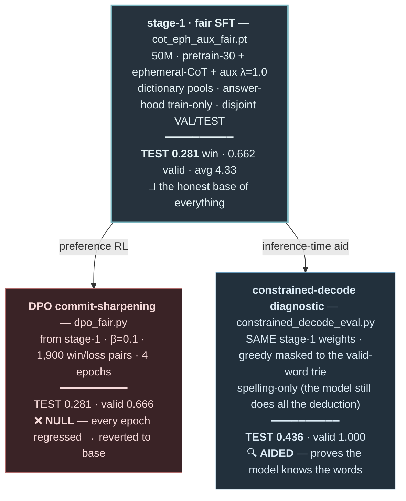

# Experiment map — STYLE SAMPLE (2 example nodes + a fork)

This is a small sample to confirm the format before I build the full map. Each **box** = one experiment
(name · script · config · ─── · result · verdict). **Arrows** = forks (what was built *from* what).
Color = outcome. (Renders on GitHub.)

**Legend (outcome colors):** 🟦 baseline/SFT · 🟥 null (no gain) · 🟦(blue) aided/diagnostic · (full map
will add 🟩 genuine improvement). Emoji verdicts: ❌ null · 🔍 aided · 🎯 win · ⚠️ regressed/contaminated.

## What the full map will contain
~30–40 nodes across the whole thread, grouped into lanes: **foundations** (pretrain → char-SFT → CoT →
aux → DPO) · **honesty audits** (contamination → clean re-run → fair recipe) · **RL** (GRPO variants) ·
**validity push** (DAgger, distillation, info-gain XIT) · **scale sweep** (tiny/base/large/xl) ·
**inference** (constrained-decode, best-of-N N=16/64/128, beam). Every fork edge labeled with the
*decision* that spawned it (often a user steer, e.g. "make it genuinely generate words").
